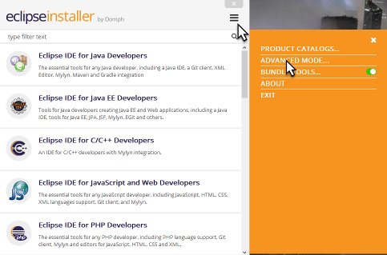
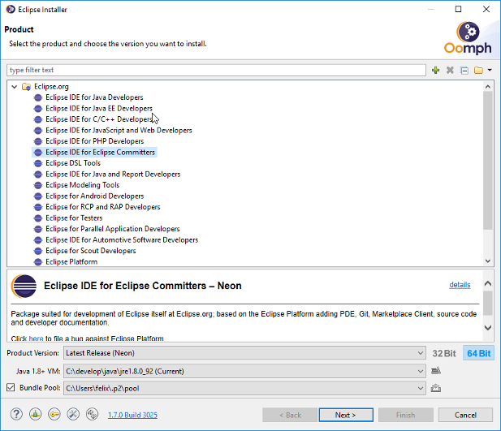
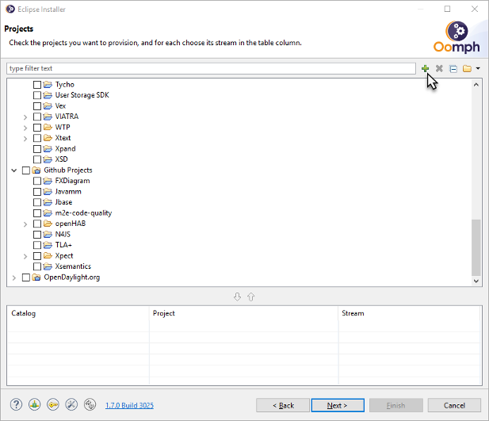
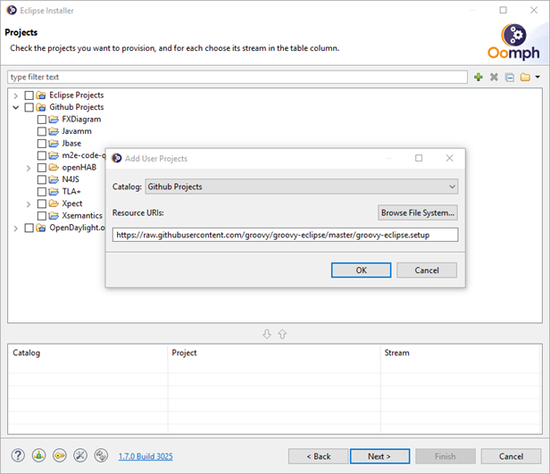
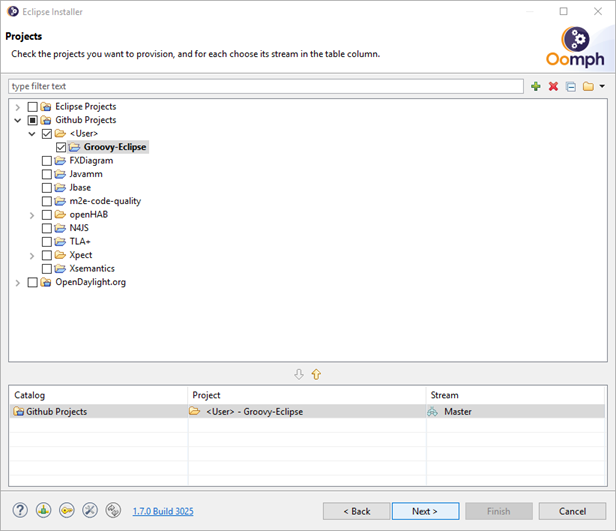
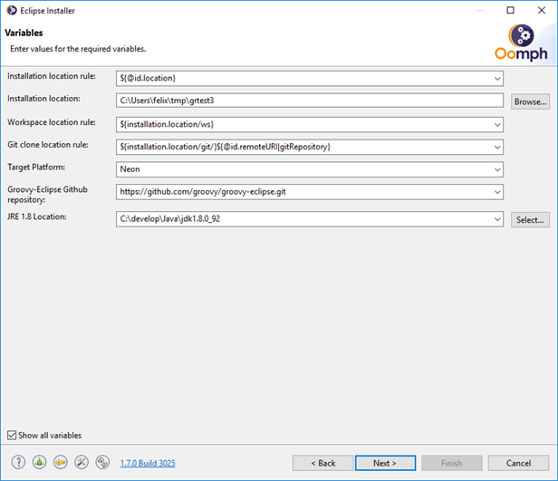
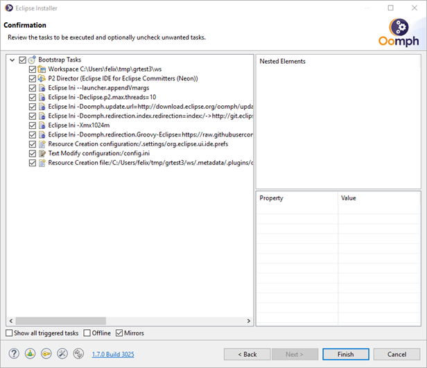
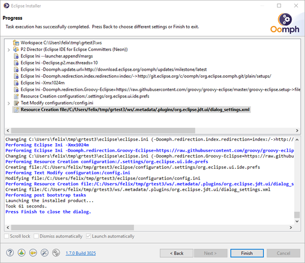
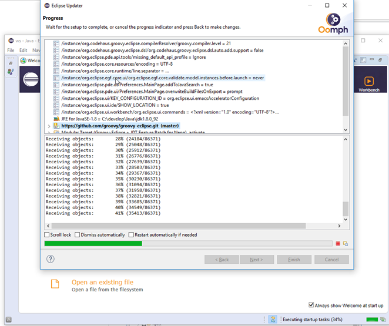
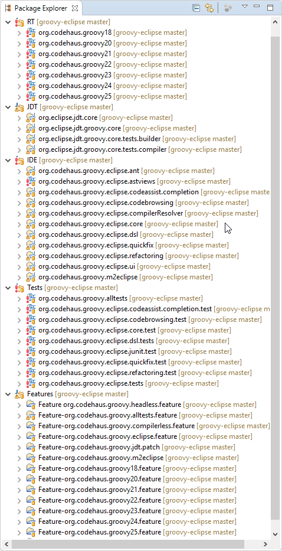

Instructions for provisioning a groovy eclipse development environment with Oomph
=================================================================================

Download and run the eclipse installer [here](https://wiki.eclipse.org/Eclipse_Installer).

Switch the installer to *Advanced Mode*:

Pick a suitable base package on the product page. You are free to choose any base package, but I always choose the Eclipse Committers package and select latest release:

Click "Next".

The next step is only required during this testing phase. (Once the setup is merged to the Groovy-Eclipse master branch it can be added to the project catalog and Groovy-Eclipse will appear automatically). For now you have to add the project setup manually to the catalog by clicking the small green "+" on top of the wizard:

Select *Github Projects* from the dropdown list and paste the following url into the text field and press OK.

https://raw.githubusercontent.com/groovy/groovy-eclipse/master/groovy-eclipse.setup

Groovy-Eclipse will now appear as a project under Github Projects/User. Select it and press Next.

The installer will now ask you to fill out a few values, such as, where to install the ide, where to put the workspace, where to clone the git respository to and which method to use for the clone. Unless you have write access to the Groovy-Eclipse repository on github, select *HTTPS (Read-only, Anonymous)* from the dropdown. For target platform use Neon or Oxygen. Older targets are supported, but I don't see a good reason why you'd want that. Select *next* when you have set all values to your likings.

The next screen shows what will be done to bootstrap the IDE. Click Finish to start with the bootstrap process:

The installer will now download the required eclipse bundles and once done, start up the new IDE to continue with the installation. You can close the installer window once this happened:

By the time you switch to the IDE, oomph is probably already cloning the Groovy-Eclipse repository. Click the small turning arrow on the ide status bar to see what's going on in the background:

Oomph then downloads the required target platform bundles, imports the Groovy-Eclipse projects into the workspace and organizes them into working sets. Eventually the setup is done and a build is triggered. After the build completes, your package explorer should look like this.

Note that there are errors. Switch to the Groovy 2.1 compiler in the Groovy preferences, restart and perform a clean build. The errors should disappear. (Unfortunately this step cannot be automated at the moment) 

Now close all org.codehaus.groovyXX projects except org.codehaus.groovy25 and try running the GroovyJDTTests or AllGroovyTests suites.

