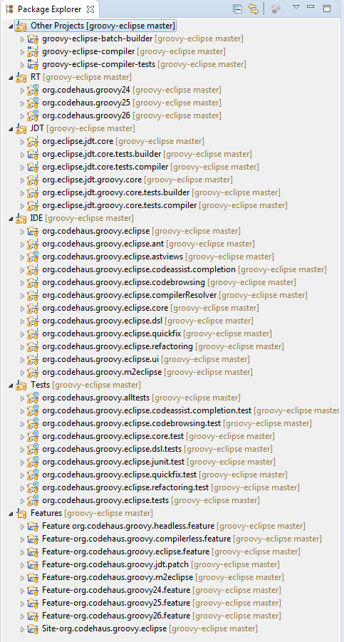

Instructions for provisioning a groovy eclipse development environment with Oomph
=================================================================================

Download and run the eclipse installer (aka Oomph) [here](https://wiki.eclipse.org/Eclipse_Installer).

Switch the installer to *Advanced Mode*:

Pick a suitable base package on the product page. You are free to choose any base package, but I always choose the Eclipse Committers package and select latest release:

Click "Next" and locate and check the Groovy-Eclipse project under Github Projects:

The installer will now ask you to make a few choices:
- Where do you want to install the IDE?
- Where do you want the workspace?
- How do you access the Groovy-Eclipse git repository on github? **Unless you have write access to the Groovy-Eclipse repository on github, select 'HTTPS (Read-only, Anonymous)' from the dropdown.** 
- Where do you want to clone the git repository?
- Which target platform do you want? Use Neon or Oxygen. Older targets are supported, but I don't see a good reason why you'd want that. 
Select *next* when you have set all values to your likings.

The next screen shows what will be done to bootstrap the IDE. Click Finish to start with the bootstrap process:

The installer will now download the required eclipse bundles and once done, start up the new IDE to continue with the installation. You can close the installer window once this happened:

By the time you switch to the IDE, the installer is probably already cloning the Groovy-Eclipse repository. Click the small turning arrow on the ide status bar to see what's going on in the background:

The installer then downloads the required target platform bundles, imports the Groovy-Eclipse projects into the workspace and organizes them into working sets. Eventually the setup is done and a build is triggered. After the build completes, your package explorer should look like this.

Now close all org.codehaus.groovyXX projects except org.codehaus.groovy25 and try running the GroovyJDTTests or AllGroovyTests suites.

