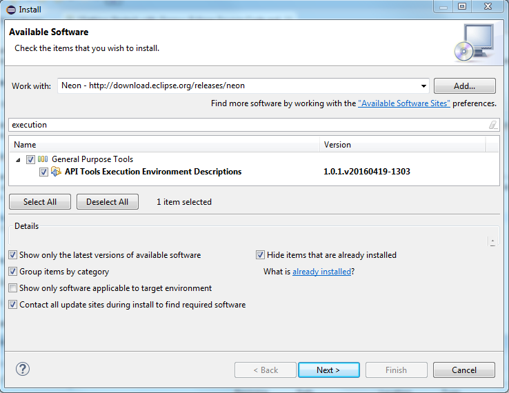
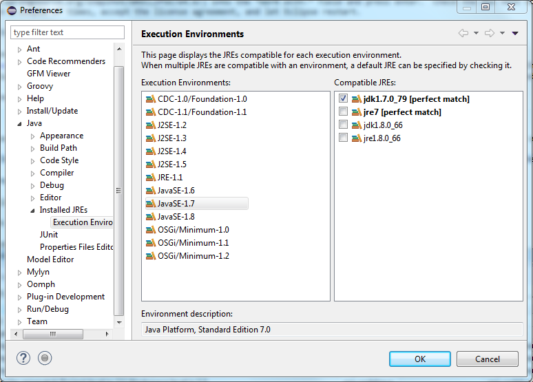
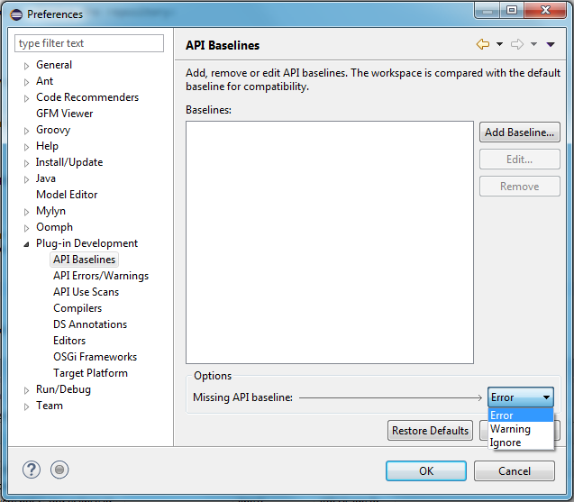

## Manual Development Environment Setup ##

These are old instructions for setting up a Groovy-Eclipse development environment *manually*. It is much easier to use the new [automated setup based method](https://github.com/groovy/groovy-eclipse/blob/master/docs/Getting-Started-with-Groovy-Eclipse-Source-Code.md#development-environment-setup) instead.

### Get the Base Eclipse Package

Groovy-Eclipse is intended to be developed using Eclipse. Download and install [the "Eclipse IDE for Eclipse Committers" package](https://eclipse.org/downloads/packages/release/2023-12/r/eclipse-ide-eclipse-committers) for your operating system.

### Install Groovy-Eclipse

On the Eclipse menu bar, select *Help -> Install New Software...*.  In the *Install* window, paste the Groovy-Eclipse update site `https://groovy.jfrog.io/artifactory/plugins-release/e4.30` into the *Work with:* field and press enter. Check the box next to "Main Package", then click the *Next* button a couple of times, accept the license agreement, and let Eclipse restart.

### Setup Groovy Compiler

If you installed extra Groovy compiler versions, then you must activate Groovy 3.0 compiler for Groovy-Eclipse.  On the Eclipse menu bar, select *Window -> Preferences*.  In the *Preferences* window, go to *Groovy -> Compiler*. Click the *Switch to 3.0.21* button, and let Eclipse restart.

### Install Execution Environment Descriptions

On the Eclipse menu bar, select *Help -> Install New Software...*.  In the *Install* window, select `2023-12 - https://download.eclipse.org/releases/2023-12` from the *Work with:* field and enter "exeuction" in the filter. Check the boxes next to "API Tools Execution Environment Descriptions", and click the *Next* button a couple of times, accept the license agreement, and let Eclipse restart.



### Setup Execution Environment Descriptions

On the Eclipse menu bar, select *Window -> Preferences*.  In the *Preferences* window, go to *Java -> Installed JREs* and add JDK 8, 11 and 17. Then go to *Java -> Installed JREs -> Execution Environments*, select JavaSE-1.8, and check the box next to JDK 8 in the list of compatible JREs.  Repeat for JDK 11, 17 and 21.



### Disable Missing API Baseline Errors

On the Eclipse menu bar, select *Window -> Preferences*.  In the *Preferences* window, go to *Plug-in Development -> API Baselines*. Select either *Ignore* or *Warning* instead of *Error* in the *Missing API Baseline:* drop-down list.



## Get Source Code

The source code can be obtained by cloning the repository:

```
https://github.com/groovy/groovy-eclipse.git
```

Import the projects that you want to work with into your workspace.  If you do not know how to clone a repository or import projects from a repository, refer to the [EGit User Guide](https://wiki.eclipse.org/EGit/User_Guide).
